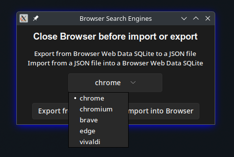
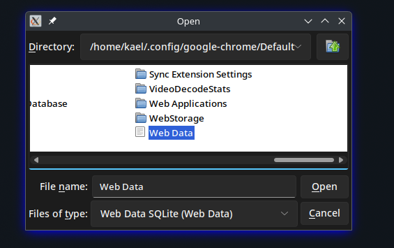
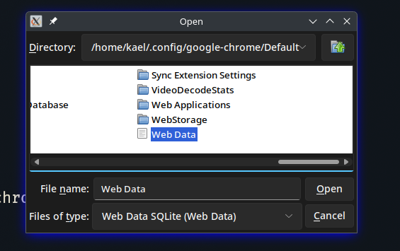

Tool for **Export/Import** search engines between **Chromium**-based **browsers**.

## Use
Using UV:
```bash
uv run main.py
```

### Select the browser



### Export search engines to a JSON file

The JSON file is saved in the same directory as the script,
with the name `engines.json`.

### Import search engines from a JSON file

The JSONfile must be in the same directory as the script,
with the name `engines.json`.
